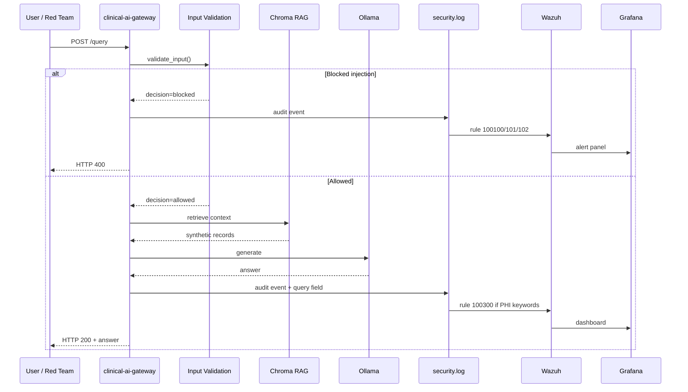
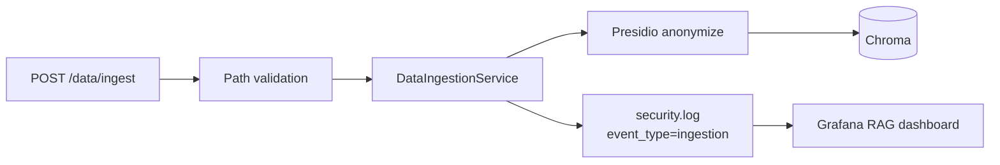
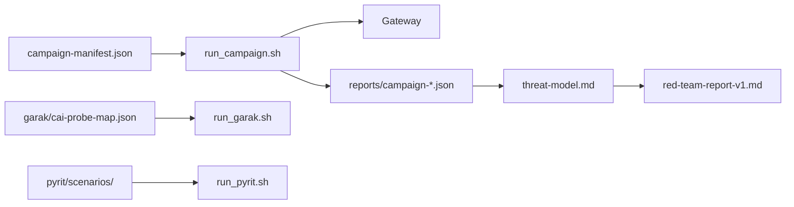

# Data Flow — Clinical AI Security Pipeline

End-to-end flow from query to detection alert.

```mermaid
sequenceDiagram
    participant U as User / Red Team
    participant G as clinical-ai-gateway
    participant V as Input Validation
    participant R as Chroma RAG
    participant L as Ollama
    participant A as security.log
    participant W as Wazuh
    participant F as Grafana

    U->>G: POST /query
    G->>V: validate_input()
    alt Blocked injection
        V-->>G: decision=blocked
        G->>A: audit event
        A->>W: rule 100100/101/102
        W->>F: alert panel
        G-->>U: HTTP 400
    else Allowed
        V-->>G: decision=allowed
        G->>R: retrieve context
        R-->>G: synthetic records
        G->>L: generate
        L-->>G: answer
        G->>A: audit event + query field
        A->>W: rule 100300 if PHI keywords
        W->>F: dashboard
        G-->>U: HTTP 200 + answer
    end
```

## Ingestion Flow

```mermaid
flowchart LR
    I[POST /data/ingest] --> P[Path validation]
    P --> D[DataIngestionService]
    D --> PR[Presidio anonymize]
    PR --> C[(Chroma)]
    D --> A[security.log<br/>event_type=ingestion]
    A --> G[Grafana RAG dashboard]
```

## Attack Validation Flow

```mermaid
flowchart LR
    M[campaign-manifest.json] --> C[run_campaign.sh]
    C --> G[Gateway]
    C --> R[reports/campaign-*.json]
    GK[garak/cai-probe-map.json] --> GK2[run_garak.sh]
    PY[pyrit/scenarios/] --> PY2[run_pyrit.sh]
    R --> TM[threat-model.md]
    TM --> RR[red-team-report-v1.md]
```

Related: [threat-model.md](../docs/threat-model.md)
