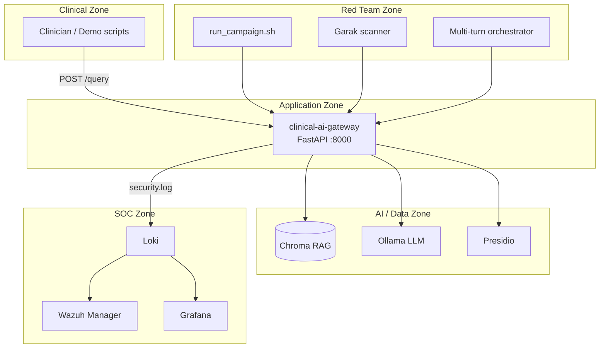

# Network Architecture

MedSecLab clinical AI security lab — logical zones.

## Zone Summary

| Zone | Components | Role |
|------|------------|------|
| Clinical | Demo scripts, curl | Synthetic clinical queries |
| Application | `clinical-ai-gateway` | Validation, RAG, audit logging |
| AI / Data | Chroma, Ollama, Presidio | Inference and de-identified RAG |
| SOC | Loki, Wazuh, Grafana | Detection and investigation |
| Red Team | Campaign, Garak, PyRIT | Adversarial validation |

All data is synthetic. No production PHI.
